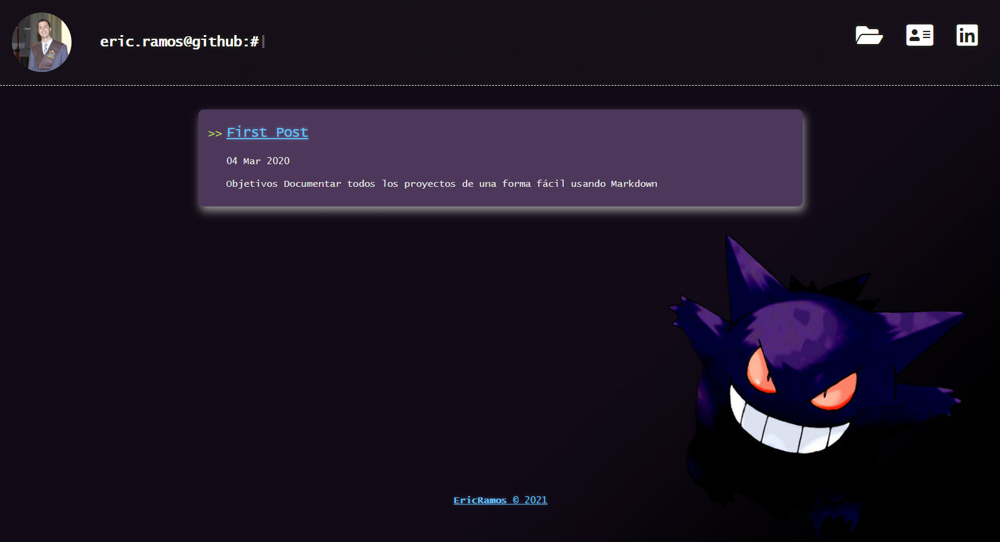

# [MAIN WEB](ericsuarez.github.io) 🎂 🐱‍🚀

Esta web será usada para postear conomicimientos y todo lo que vaya aprendiendo. 🐱‍👤
Cualquier duda me pueden contactar al email eric.ramos.suarez@gmail.com

## How it looks?

### Reconocimientos

Esta Web a sido creada a partir del tema "The Hacker-Blog theme" 

### The Hacker-Blog theme

*Hacker-Blog is a minimalistic, responsive jekyll theme built for hackers. It is based on the [hacker theme](https://github.com/pages-themes/hacker) for project pages.*

Demo: [https://ashishchaudhary.in/hacker-blog](https://ashishchaudhary.in/hacker-blog)

## Local Build

If you want to see the changes before pushing the blog to Github, do a local build.

1. [`gem install jekyll`](https://jekyllrb.com/docs/installation/#install-with-rubygems)
2. `gem install jekyll-seo-tag`
3. `gem install jekyll-paginate`
4. `gem install jekyll-sitemap`
5. (`cd` to the blog directory, then:) `jekyll serve --watch --port 8000 --incremental`
6. Go to `http://0.0.0.0:8000/` in your web browser.

*Note: In case you have set a `baseurl` different than `/` in `_config.yml`, go to `http://0.0.0.0:8000/BASEURL/` instead.*
