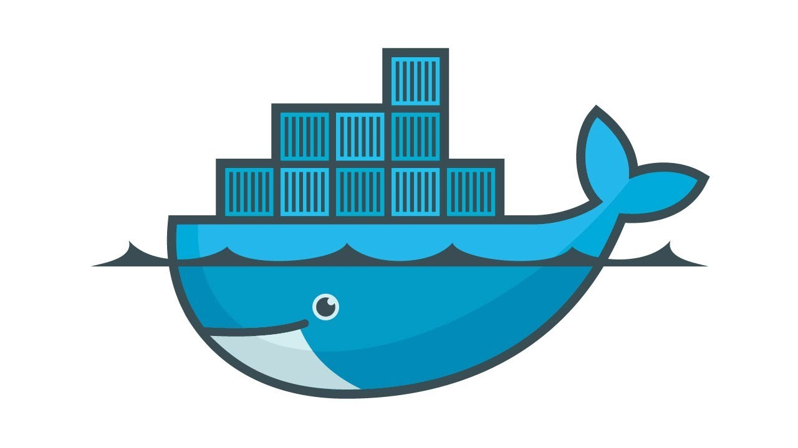

***Cheatsheet de todo lo aprendido en Docker***


### ¿Qué es Docker?
Permite automatizar despliegue de aplicaciones dentro de espacios virtualizados

***Imagen*** -> plantilla para la creación de contenedores

***Contenedores*** -> Espacio auto-contenido incluye necesario para la ejecución de aplicacioens

Es similar a máquina virtual 

Imagen plano o maqueta del edificio y el contenedor es el edificio en sí

La gestión de imágenes y contenedores las hace dockerd. Un servicio

Usamos el cliente para conectarnos con el servicio

Se pueden gestionar distintas redes y clusters de contenedores y volúmenes.

### Introducción

Salomón Hykes en dotCloud ->integración continúa. Lo sacó a software libre en el 2013

***Proyecto insignia en Red Hub. ***

***Propone seguir un modelo fijo*** -> la forma en la que se define

***Integración continua*** -> CI, entrega continua -> CD 

#### Diferencia entre VM y Contenedores
Los contenedores no tienen Hypervisor ni guest OS. El motor de docker usa los servicios del SO fuente independizando los contenedores.


### Instalación

Versión comunitaria 
Versión empresarial

Documentación muy bien hecha

En cuanto se termine tenemos el servicio y el cliente de docker en la máquina

systemctl status docker.service  -> comando gestionar servicios

Docker -v vemos el cliente

Docker -h muestra los comandos disponibles

### Servicio dockerd

systemctl -> interfaz de system.d (mecanismo reciente que gestiona muchas cosas del so) argumentos. STATUS, START, STOP,RESTART

comandos client -> inspect, kill, load

Docker ps -> para ver los contenedores que se encuentran en ejecución

El cliente se conecta con el servicio de docker


### Primer contenedor

```bash
Docker run  # lanza comando sobre un nuevo contenedor que se crea al instante
```
Todos los comandos tienen el --h

docker run hello-world -> primero lo busca localmente y después si no lo encuentra lo busca y lo descarga desde docker-hub

si no ponemos nada descargar el latest 

nifty_mclaren 
loving_diffie <3 lovid

```bash
docker ps # muestra los contenedores pero este no sale porque no es interactivo sino que se ejecuta y ya y docker ps -a si que lo muestra 

docker run busybox # (otro)
docker run ubuntu

```

Estos comandos no hacen mucho


### Comandos listado Contenedores

```bash
docker ps -a -q # (Solo muestra los identificadores)
docker ps -a -s # (tamaño)

Con la opción -f # podemos hacer un filtro por lo que queramos casi 

docker ps -f name=_lov


```


### Comandos listado Imágenes


```bash
docker images -a # para verlas todas
docker images -q # para vert los indentificadores
docker images ubuntu - > filtra por ubuntu

docker images --no-trunk  # para ver el hash completo

docker image    # PARA GESTIONAR IMÁGENES NO PARA LISTAR


```

### Contenedores interactivos

```bash
docker run -it # (interactivo y con terminal tipo tty)  

# Se ve que lo último es el comando que queremos ejecutar
 docker run -it fedora bash

docker start -i # y con los primeros numeros del contenedor podemos interactuar con el 

docker stop # para detener un contenedor

docker run -it -d(BACKGROUND) --name  # para asignarle un nombre

docker run -it -d --name fedoracoretest fedora bash

```


### Borrar contenedores

````bash
docker rm <identificador>

docker create # lo creamos pero no lo arrancamos
 
docker create -it ngnix # lo crea pero no lo arranca

docker container # varios comandos, hay algunos que tienen alias 

docker start identificador #  lo lanza (SI PONE UP ESTÁ LEVANTADO)

docker  image save ubuntu -o /home/ubuntuimage.tar # la guarda

docker image rm hello-world:latest
````

### Comandos útiles

```bash

docker run -d --name testing nginx
docker logs testing
docker exec (LANZA COMANDO)

docker exec -it testing bash (Si entramos y ejecutamos cosas nos aparecen en logs)

docker top testing (nos muestra los procesos)

docker stats para ver las estadisticas

docker kill # más similar al stop pero más bruto -> da un código más raro es mejor hacerlo con stop

```
